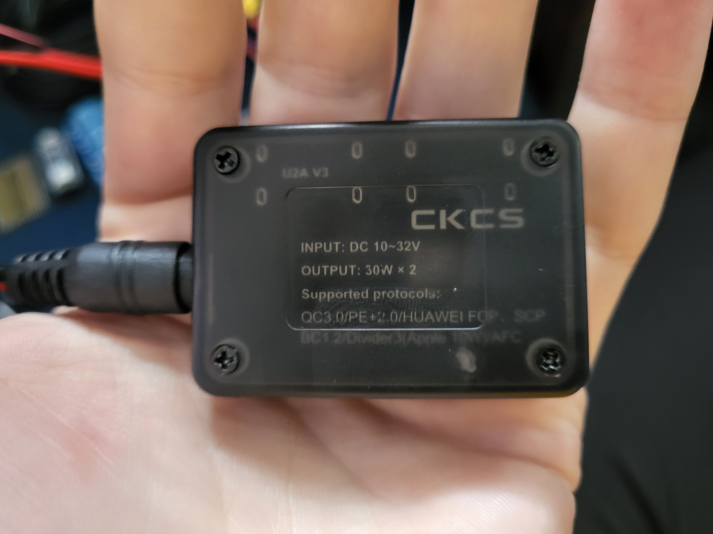

# The Build

Good job getting the app installed and programming the arduino. We're now getting to the hardest part of the project. Actually putting it all together and installing it in the car. Bear with me, I will try to make this as clear and painless as possible.

## Table of Contents
- [Component Overview]()
  - [What each one does]()
  
    
- [Soldering the Arduino]()

- [Perparing the Car]()
  - [Which wires]()
  - [Running new wires]()
  
- [Black Box]()
  - [Installing each component]()
    - ... (each one here)

- [Putting it all together]()
  - [Soldering to black box]()
  - [Connecting headlight wires]()

## Component Overview
In this section we will learn what each component used in this project does.
![]

### What each one does
If you want to skip the introduction to each component, skip to [Soldering the Arduino]().

#### Arduino Nano 33 BLE Rev2

This little guy will act as the brains of the whole opperation. You should have already programmed the board, but if not, that isn't that big of a deal, and can be done at any time. Just go to [Programming your Arduino](). It will be recieving commands from your phone and turning that into the correct pulses to make the headlights move how you want.

#### Relays

This allows your Nano to communicate with the headlights. The headlights run off of your car battery, which, is ~12V off, and somewhere around 14V. The arduino Nano only outputs around 3V, nowhere close to what is needed to drive the motors. (Theoretically it might work, but just be super slow.)

So, we use the relay. The relay is turned on or off depending on what command is sent, allowing a 12V source from the car to travel through and power the headlights in the way you want it to. 

#### Optocoupler

This component is pretty cool, and I only learned about it just recently, and it allows the 12V environment in the car to be safely coupled to the 3.3V envirnment of the Nano. It does this by separating the input and output side physically, and communicating the signal through light, using a LED of sorts, and a photodetector to recieve the signal on the other end. In this project, we use this to communicate with the OEM headlight button, allowing it to be used as normal.

#### Battery and Power Supply

Fairly self explanitory, but this is what will be providing power to the Nano. The Nano itself will draw directly from the battery, and, with the size I purchased, (3000mAh), it will be able to power the Nano for quite a long time. This makes the power supply an optional expense. While I would personally recommend it, so you never have to worry about charging the battery, it isn't entirely necessary. Dont forget to get a couple short cables to power the board and the battery (if you decide to use a power supply too).

#### Solder Breadboard

I'd highly recommend using a breadboard that requires soldering. Using a regular breadboard could cause your connections to come loose, and fail overtime. Soldering will help make it permanent. 

#### Cat break

Make sure you have your trusty partner to help you along in this project. This'll be the hardest part!

## Soldering the Arduino

### Arduino Pinout

