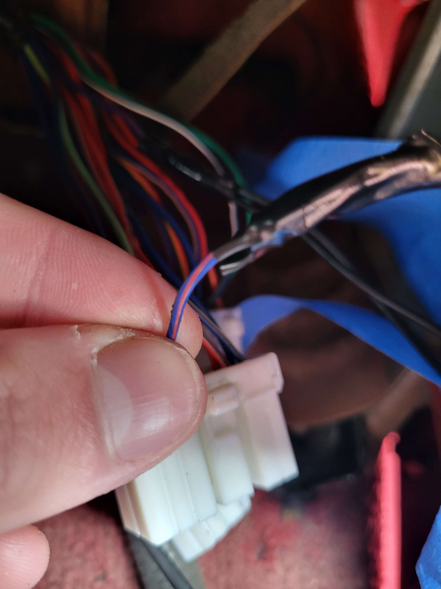
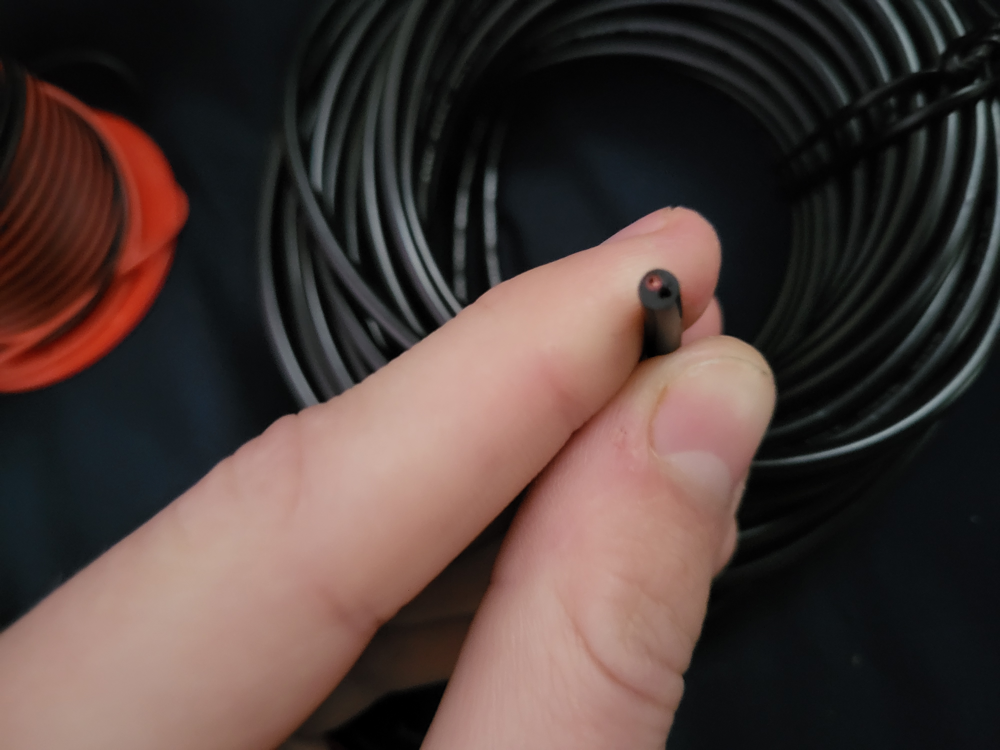
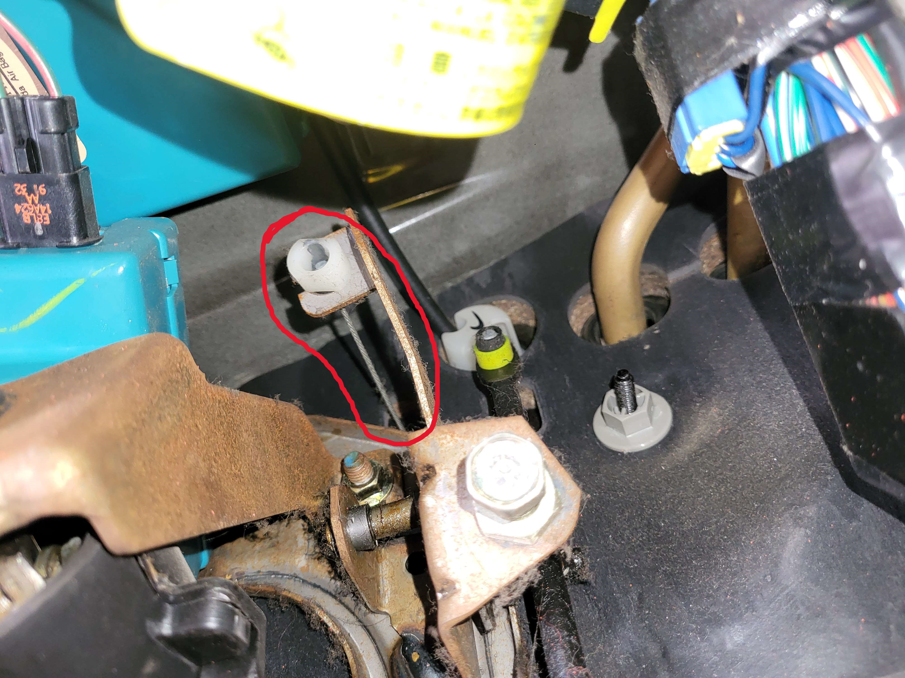

# The Build

Good job getting the app installed and programming the arduino. We're now getting to the hardest part of the project. Actually putting it all together and installing it in the car. Bear with me, I will try to make this as clear and painless as possible.

## Table of Contents
- [Component Overview](#component-overview)
  - [What each one does](#what-each-one-does)
  
    
- [Soldering the Arduino](#solder-breadboard)

- [Perparing the Car](#preparing-the-car)
  - [Which wires](#which-wires)
  - [Running new wires](#running-the-wires)
  
- [Installing Components](#installing-components)
  - [Ideal Mounts](#ideal-mounts)
  - [Alternative](#alternative)

## Component Overview
In this section we will learn what each component used in this project does.

### What each one does
If you want to skip the introduction to each component, skip to [Soldering the Arduino](#solder-breadboard).

#### Arduino Nano 33 BLE Rev2

This little guy will act as the brains of the whole opperation. You should have already programmed the board, but if not, that isn't that big of a deal, and can be done at any time. Just go to [Programming your Arduino](https://github.com/seasaltsaige/popup-wink-mod/edit/master/build/Code/Arduino/Programming.md). It will be recieving commands from your phone and turning that into the correct pulses to make the headlights move how you want.

#### Relays

This allows your Nano to communicate with the headlights. The headlights run off of your car battery, which, is ~12V off, and somewhere around 14V. The arduino Nano only outputs around 3V, nowhere close to what is needed to drive the motors. (Theoretically it might work, but just be super slow.)

So, we use the relay. The relay is turned on or off depending on what command is sent, allowing a 12V source from the car to travel through and power the headlights in the way you want it to. 

#### Optocoupler

This component is pretty cool, and I only learned about it just recently, and it allows the 12V environment in the car to be safely coupled to the 3.3V envirnment of the Nano. It does this by separating the input and output side physically, and communicating the signal through light, using a LED of sorts, and a photodetector to recieve the signal on the other end. In this project, we use this to communicate with the OEM headlight button, allowing it to be used as normal.

#### Battery and Power Supply

Fairly self explanitory, but this is what will be providing power to the Nano. The Nano itself will draw directly from the battery, and, with the size I purchased, (3000mAh), it will be able to power the Nano for quite a long time. This makes the power supply an optional expense. While I would personally recommend it, so you never have to worry about charging the battery, it isn't entirely necessary. Dont forget to get a couple short cables to power the board and the battery (if you decide to use a power supply too).

#### Solder Breadboard

I'd highly recommend using a breadboard that requires soldering. Using a regular breadboard could cause your connections to come loose, and fail overtime. Soldering will help make it permanent. 

#### Cat break

Make sure you have your trusty partner to help you along in this project. This'll be the hardest part!

## Soldering the Arduino

### Arduino Pinout

Following the first pinout image, we can see, according to specifically the unmodified code in this repository, we will be using the pins highlighted in the second image. 

The pin below D13 will be out main power source, the 2nd pin from the bottom, above Vin, will be our ground pin. (You can use the other one if you want) And then, D12 and D11 will be Left Up and Left Down respectively, while D3 and D2 will be Right Up and Right Down. If you modify the code, and change the pins, just make sure to wire it up according to your code, and not this diagram. For the OEM button, we will be using D5 as an input.

### Soldering

In the below image, you can see that I connected the power pin to a free rail, and the ground pin to the other free rail. This isn't entirely necessary, and you can solder all your wires directly, but it just makes it a bit easier to have entire rails to solder to.
Other than that, just connect wires to each pin mentioned.
Again, while soldering, make sure you wear a mask and eye protection, the fumes are not good for you.

There are two ground wires as one goes to the oem switch setup, and one goes to the relay.

### Relay setup

For the relay to opperate, we need to provide it with a power source (VCC, 3.3V) and ground (GND), along with the pins from the arduino to control it.

Following the description in the first image, connect each corresponding pin on from the breadboard. For reference, follow the second image.

On the output side of the relay, we will be using the "left" and "middle" pin of each relay. The middle pin is the source, where we will be feeding the 12V INTO, and the left pins are the NO (Normally Open) pins. This means that when no power is run to the input side of the relay, these left hand pins will be Open, meaning no voltage will be suplied. This is what we want.

Connect each middle pin to each other with short bits of wire, with one longer lead running off of it. This longer lead will run to our constant 12V source in the car.

These red and black wires are temporary, for the purpose of the docs, but we will be connecting 4 wires total to the outputs of the relay, from left to right: Red - Right Up, Black - Right Down, Red - Left Up, Black - Left Down.

You don't need to follow this convention, but I just did it so I could remember which wires are which. Down will be black, and Up will be red.

### Optocoupler

This will be the connection point between the OEM Button and our new system. The left side is not connected, as that will be connecting to 12V of the button, and ground in the car. On the right side, we can disregard the VCC pin. What we need to do is connect D5 to the "OUT" pin, and a ground wire to "GND". Since we have pin D5 set to "INPUT_PULLUP", what this does, is when the circuit is completed, it will allow D5 to be shorted to ground, pulling it to LOW. The code is setup for this, but if you know what you're doing, feel free to change whatever you want.

## Preparing the car
To preface this section, if you are doing this on an NA Miata, and you have Cruise Control, you will likely need to drill some holes in the firewall of the car. If you don't have cruise control, you're "lucky" as there will be a grommet already installed where the cruise cable would go through. You can just use this hole to run the wires.

But before that...
#### Cat break

## Which Wires

### Radio Harness
Again, all of these wire colors and pictures are of a ***1993 Miata*** if you have '94-'98 miata, your colors and harness may be different, and if you have a different color, please research your wiring harness before. Don't blindly follow this guide. It serves as a reference.

On the largest connector that goes to your radio, there is a wire that supplies a constant 12V source, as to run the clock. We will be splicing into this wire, as we want constant 12V, so we are able to use the headlights both while the car is on, or off. On **my** car, this is the Blue w/ Red stripe, that goes to the largest connector.

I spliced into it, and wired in two wires. One to reconnect to the harness plug, and one to go off to power the relays.

TBD: Might take power from here as well to charge the battery bank. Either that, or a keyed 12V source.

The ground wire is the thicker, black wire, with a circle connector on the end. We can use one of our T-Junction connectors to splice into this cable, as to avoid as much cutting of the harness.

### Headlamp Motor Wiring

On ***1989-1993*** Miatas, the headlamp harness has two wires for Up and Down. These opperate separately from each other. The **White with Red Stripe** is for the "Down" voltage, while the **Red with Yellow Stripe** is for the "Up" voltage. These will both be spliced with quick disconnect connectors.

After splicing. We can connect the female spade connector to the hub side (left in the image) and the male side to the actual harness. Doing this allows you to quickly remove the custom harness from the connectors, and reset back to stock wiring.

This is the new wiring connections, connecting black (down) to the white with red, and the red wire, to the red with yellow. This is just how I have mine set-up, and yours may be different depnding on the wire you got.

Speaking of wire, here is the kind of wire I decided to get for this part.

This is fairly insulated wire, with two core wires run inside. I decided to get this specifically as the environment in the engine bay is quite harsh, so having insullation from the heat will be important.

## Running the wires
This part will differ from car to car, as, even with the same year of Miata, you may or may not have it easier than others. If your car *does* have cruise control, as in the case with my car, you will have to do a bit more work to be able to run the wires through the firewall. If you don't, congrats, you have it easier!

#### No cruise
Briefly, if you don't have cruise, on the drivers side of the engine bay, up on the firewall, you will see two pipes running into the firewall. These are for your heatercore. Don't mess with them. Nearby you should see an open grommet, or at least, grommet with no wires passing through. Use this to pass your wires through, and only follow the next steps as a general process.
### Cruise Controll Cars

From the inside of the car, under the dash, on the gas pedal, we will find two cables mounted to it. (1 for cruise-less cars) The one circled is your cruise cable. We will be making new holes nearby this cable. Really, you can make your holes in the firewall wherever you want, but I'd recommend on this side, as the otherside has a bunch of stuff in the way.

View From the outside, on the drivers side. (Circled being the cruise cable.)

Ideally, you would either create your own, new grommet, or find a pre-existing area to wire your cables through, but I ended up using the holes where the heatercore pipes run, even though I recommend not doing that. They can get hot, though, with insulated wires, they will likely be fine, as long as the temp rating is high enough. I would still recommend finding a better area to route the cables, if you can.

Cables Entering through heatercore grommet.
Make sure you keep track of which cable goes to which headlight. It's easy to mix them up if you don't.

Cables routed under the dash, where the heater core is, and through to where your radio normall is. Now, this is much easier if you have your radio out, if you choose to mount your components like I do (which I don't entirely recommend. You will see why.)

Route the cables away from the engine, to keep it away from the extreme temps.

Connections on drivers side

Connections on passangers side

Note: I decided to use RED as UP and BLACK as DOWN, meaning I am connecting RED to RED w/ YELLOW, and BLACK to WHITE w/ RED

If you decide to keep the OEM button functionality (which I recommend), you will need to remove the tombstone center plate (if you have a Miata), and find the RED w/ YELLOW wire on the button.
Second from the left, on the bottom. We will want to splice into this, and run a wire down to the radio hole, along with the rest of the cables.

Run wire

We will want a few ground leads, so we can take that off of any point on the car, but I chose to use the close by radio ground, using a T-Junction splice.

All in all, we should have two constant 12V wires, two ground wires, and a 12V source from the OEM button. We can run these under the console area like so.

One 12V source to the relay COM port, one 12V source to the power supply, one ground source to the optocoupler, one ground source to the power supply, and the switched 12V source to the optocoupler.

## Installing Components

### Ideal Mounts
Realistically, you should probably get a project box, mount everything securely in said box, and then mount that somewhere under the dash, to keep everything as neat and tidy as possible. Well, I decided to not do that for various reasons, but I wouldn't recommend following this step, and do your own work instead.

### Alternative
If you want to follow what I do, feel free. It was just most convinient for me. I plan to mount them more securely with double sided tape as opposed to electrical tape soon.

Power Supply and battery location

Main components

Once everything is connected and wired up, congrats! Your app should now be able to connect to the Nano, and control it with the provided controller! (Don't do this while driving >:( I know it's tempting)