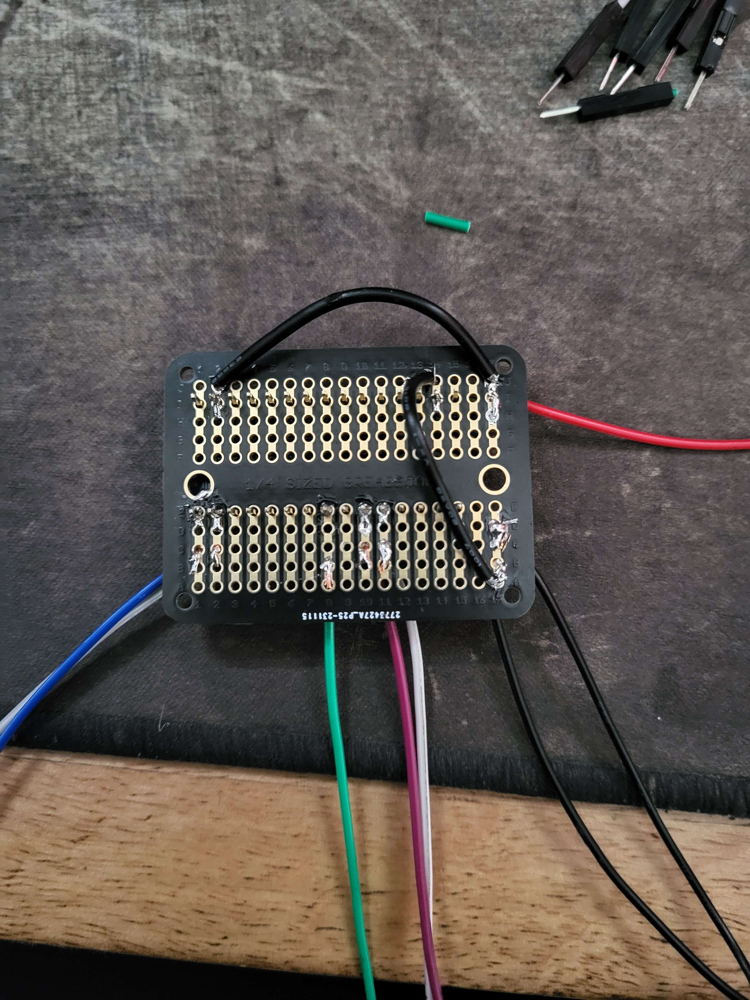

# The Build

Good job getting the app installed and programming the arduino. We're now getting to the hardest part of the project. Actually putting it all together and installing it in the car. Bear with me, I will try to make this as clear and painless as possible.

## Table of Contents
- [Component Overview]()
  - [What each one does]()
  
    
- [Soldering the Arduino]()

- [Perparing the Car]()
  - [Which wires]()
  - [Running new wires]()
  
- [Black Box]()
  - [Installing each component]()
    - ... (each one here)

- [Putting it all together]()
  - [Soldering to black box]()
  - [Connecting headlight wires]()

## Component Overview
In this section we will learn what each component used in this project does.
![]

### What each one does
If you want to skip the introduction to each component, skip to [Soldering the Arduino]().

#### Arduino Nano 33 BLE Rev2

This little guy will act as the brains of the whole opperation. You should have already programmed the board, but if not, that isn't that big of a deal, and can be done at any time. Just go to [Programming your Arduino](). It will be recieving commands from your phone and turning that into the correct pulses to make the headlights move how you want.

#### Relays

This allows your Nano to communicate with the headlights. The headlights run off of your car battery, which, is ~12V off, and somewhere around 14V. The arduino Nano only outputs around 3V, nowhere close to what is needed to drive the motors. (Theoretically it might work, but just be super slow.)

So, we use the relay. The relay is turned on or off depending on what command is sent, allowing a 12V source from the car to travel through and power the headlights in the way you want it to. 

#### Optocoupler

This component is pretty cool, and I only learned about it just recently, and it allows the 12V environment in the car to be safely coupled to the 3.3V envirnment of the Nano. It does this by separating the input and output side physically, and communicating the signal through light, using a LED of sorts, and a photodetector to recieve the signal on the other end. In this project, we use this to communicate with the OEM headlight button, allowing it to be used as normal.

#### Battery and Power Supply

Fairly self explanitory, but this is what will be providing power to the Nano. The Nano itself will draw directly from the battery, and, with the size I purchased, (3000mAh), it will be able to power the Nano for quite a long time. This makes the power supply an optional expense. While I would personally recommend it, so you never have to worry about charging the battery, it isn't entirely necessary. Dont forget to get a couple short cables to power the board and the battery (if you decide to use a power supply too).

#### Solder Breadboard

I'd highly recommend using a breadboard that requires soldering. Using a regular breadboard could cause your connections to come loose, and fail overtime. Soldering will help make it permanent. 

#### Cat break

Make sure you have your trusty partner to help you along in this project. This'll be the hardest part!

## Soldering the Arduino

### Arduino Pinout

Following the first pinout image, we can see, according to specifically the unmodified code in this repository, we will be using the pins highlighted in the second image. 

The pin below D13 will be out main power source, the 2nd pin from the bottom, above Vin, will be our ground pin. (You can use the other one if you want) And then, D12 and D11 will be Left Up and Left Down respectively, while D3 and D2 will be Right Up and Right Down. If you modify the code, and change the pins, just make sure to wire it up according to your code, and not this diagram. For the OEM button, we will be using D5 as an input.

### Soldering

In the below image, you can see that I connected the power pin to a free rail, and the ground pin to the other free rail. This isn't entirely necessary, and you can solder all your wires directly, but it just makes it a bit easier to have entire rails to solder to.
Other than that, just connect wires to each pin mentioned.
Again, while soldering, make sure you wear a mask and eye protection, the fumes are not good for you.

There are two ground wires as one goes to the oem switch setup, and one goes to the relay.

### Relay setup

For the relay to opperate, we need to provide it with a power source (VCC, 3.3V) and ground (GND), along with the pins from the arduino to control it.

Following the description in the first image, connect each corresponding pin on from the breadboard. For reference, follow the second image.

On the output side of the relay, we will be using the "left" and "middle" pin of each relay. The middle pin is the source, where we will be feeding the 12V INTO, and the left pins are the NO (Normally Open) pins. This means that when no power is run to the input side of the relay, these left hand pins will be Open, meaning no voltage will be suplied. This is what we want.

Connect each middle pin to each other with short bits of wire, with one longer lead running off of it. This longer lead will run to our constant 12V source in the car.

These red and black wires are temporary, for the purpose of the docs, but we will be connecting 4 wires total to the outputs of the relay, from left to right: Red - Right Up, Black - Right Down, Red - Left Up, Black - Left Down.

You don't need to follow this convention, but I just did it so I could remember which wires are which. Down will be black, and Up will be red.

## Preparing the car
To preface this section, if you are doing this on an NA Miata, and you have Cruise Control, you will likely need to drill some holes in the firewall of the car. If you don't have cruise control, you're "lucky" as there will be a grommet already installed where the cruise cable would go through. You can just use this hole to run the wires.