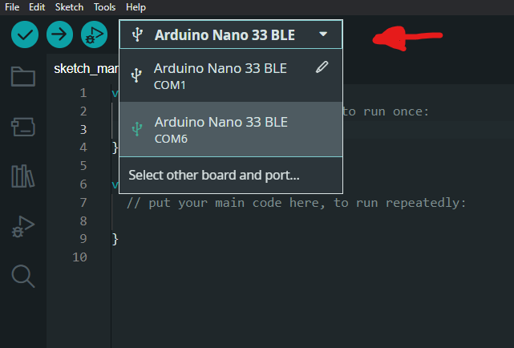

# Programming your Arduino

## Table of contents

- [Installing the Arduino IDE]()
- [Uploading the code]()
  - [Download]()
  - [Connection]()
  - [Code overview]()
    - [Download]()
    - [Modification]()
  - [Uploading to Board]()

## Installing the Arduino IDE

First, you will need to install the IDE that arduino provides. You can do so [here](https://www.arduino.cc/en/software)

## Connection
Once you have the IDE installed and open, you can go ahead and connect your Arduino to any USB port. The Arduino uses Micro USB-B as its connection.
The IDE should automatically detect it, and assign the correct COM port.

If it doesn't, you open the dropdown and select the Arduino. Make sure the COM Port is correct, otherwise the upload will fail.

## Code overview

### Download
To download the script that will be the main brains behind controlling the headlights, head to the [nano_ble](https://github.com/seasaltsaige/popup-wink-mod/blob/master/nano_ble/winkduino/winkduino.ino) folder, and click on the .ino file. In the top right of the code, there will be a "download raw" button. Download the file and save it to a folder with the same name as the file. (The IDE requires this.)

Once you have the script downloaded in its own folder, you can selected **File -> Open** in the Arduino IDE. Select the folder you just made.
You should be greeted with something along the lines of this.

Well done! You're getting there.

Now we need to make sure that the ArduinoBLE library is installed, otherwise the program will not function.

On the left side of the IDE, you can click on the library manager, and search for "ArduinoBLE". Install this library.

Almost there!

### Modifying the code
If you feel you can, feel free to change the code however you see fit. Change the delays, change the pins used, change the whole thing if you want. This should serve as a starting point to make customizing it easy! (If you are able to modify this on your own, you likely don't need to be following the installation of the program on the arduino, and/or the App, so feel free to skip to the [Build Process](https://github.com/seasaltsaige/popup-wink-mod/tree/master/build/Build/Home.md))

## Uploading the code
Once you're ready, we can go ahead and upload the code to the arduino. To do this, all you need to do is press the right arrow in the top left of the screen.

Congrats! Arduino programmed!

### [Go to App Installation -->](https://github.com/seasaltsaige/popup-wink-mod/tree/master/build/Code/App/Installing.md)