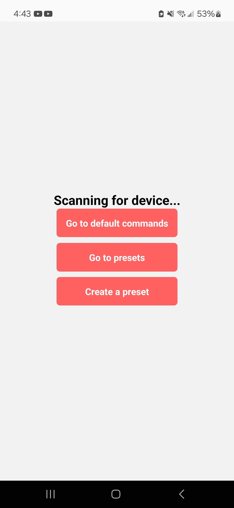
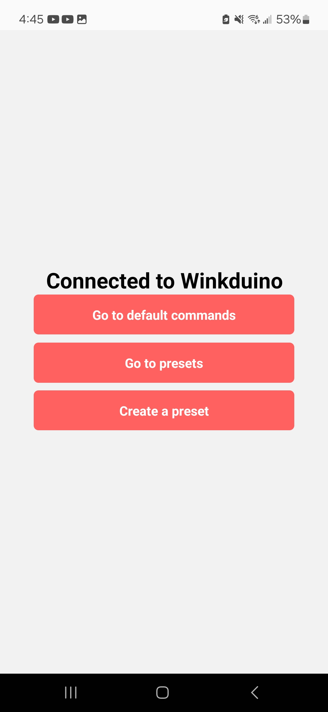
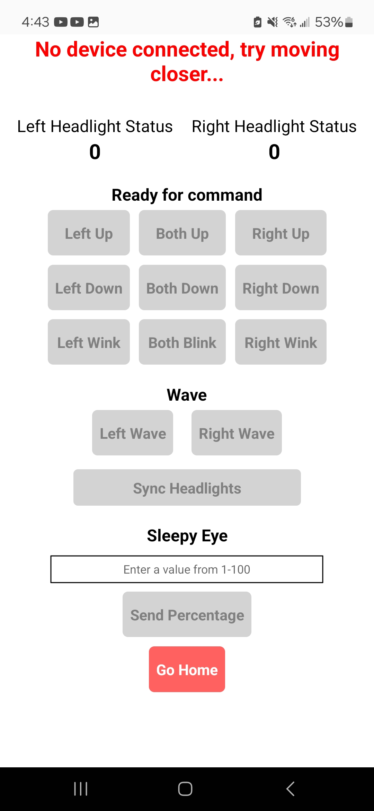
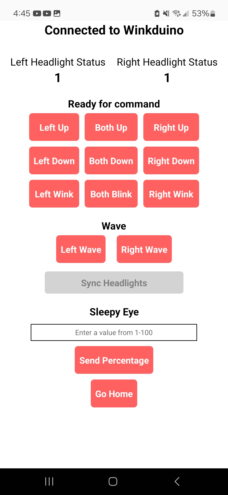
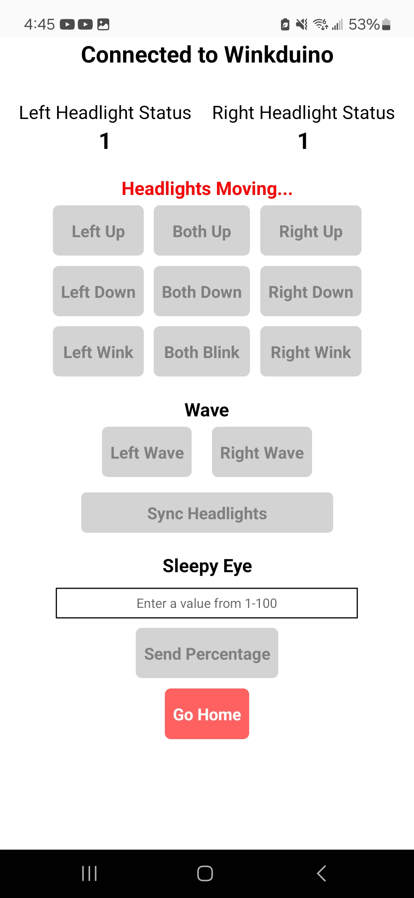
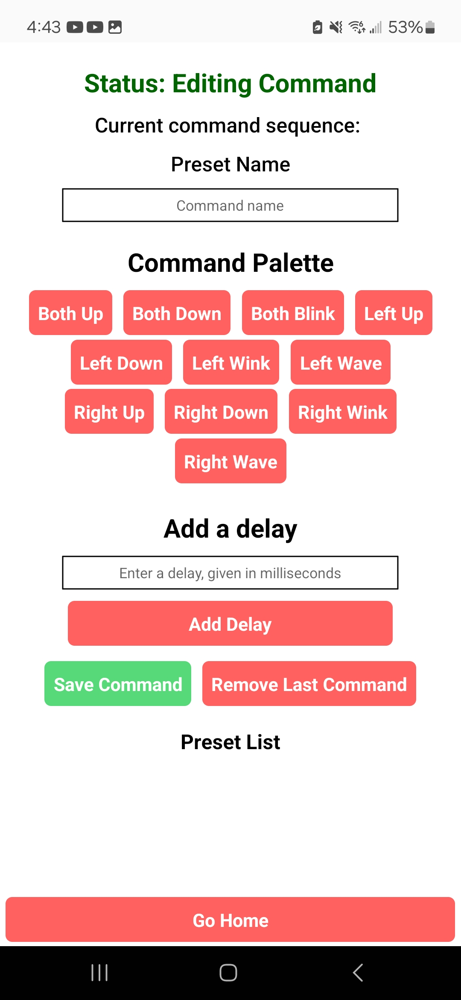
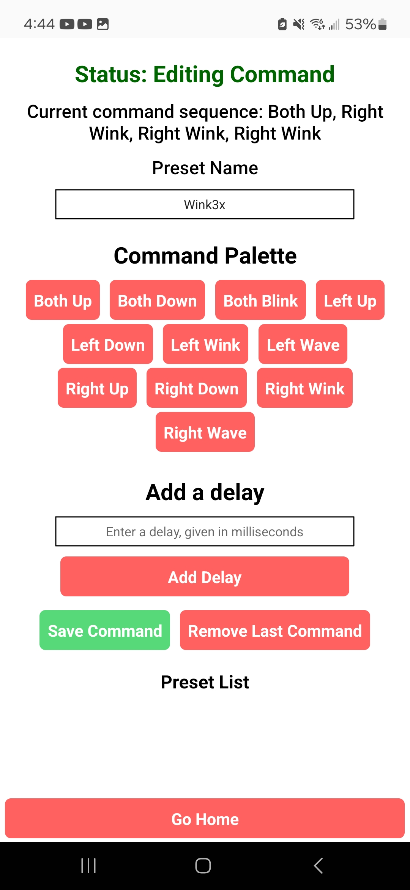
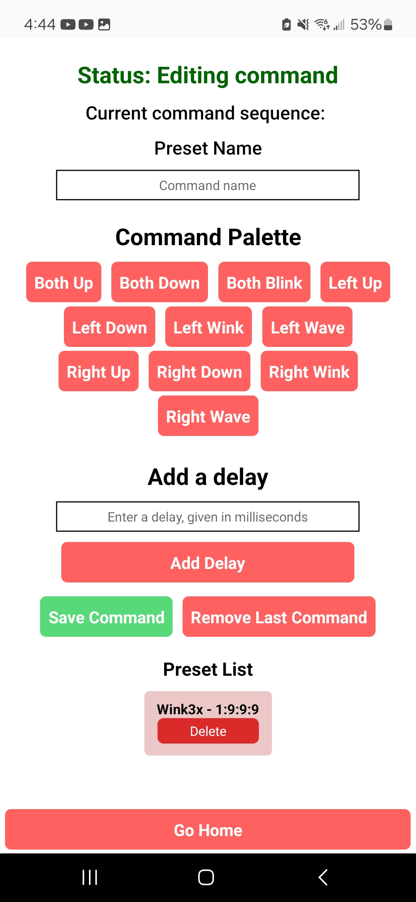
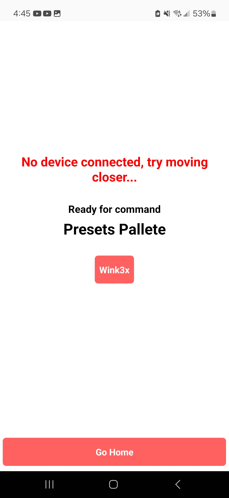
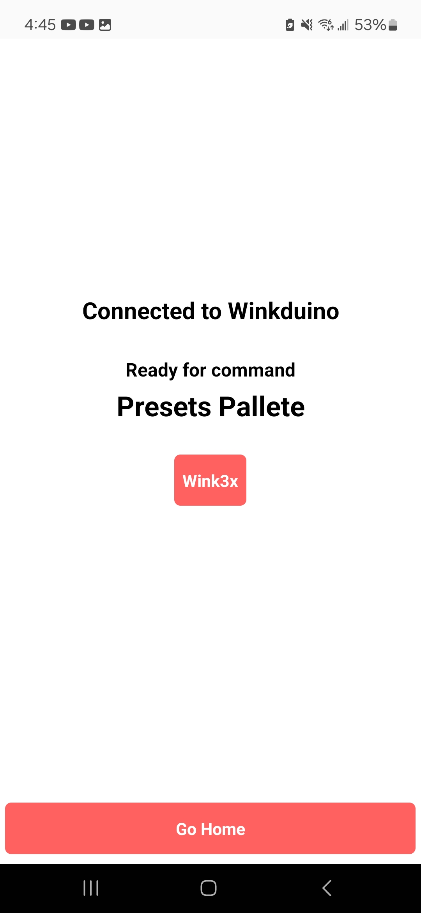

# Gallery
## App

Landing page of the app. Displayed when no device is connected.

Landing page of the app. Displayed when Winkduino is connected.

Default Commands when device is not connected

Default Commands when device IS connected

Default commands when headlights are moving

Creating a preset, to be used as a shortcut, instead of pressing multiple default commands.

Presets pallete with no connection

Presets List

## Car

